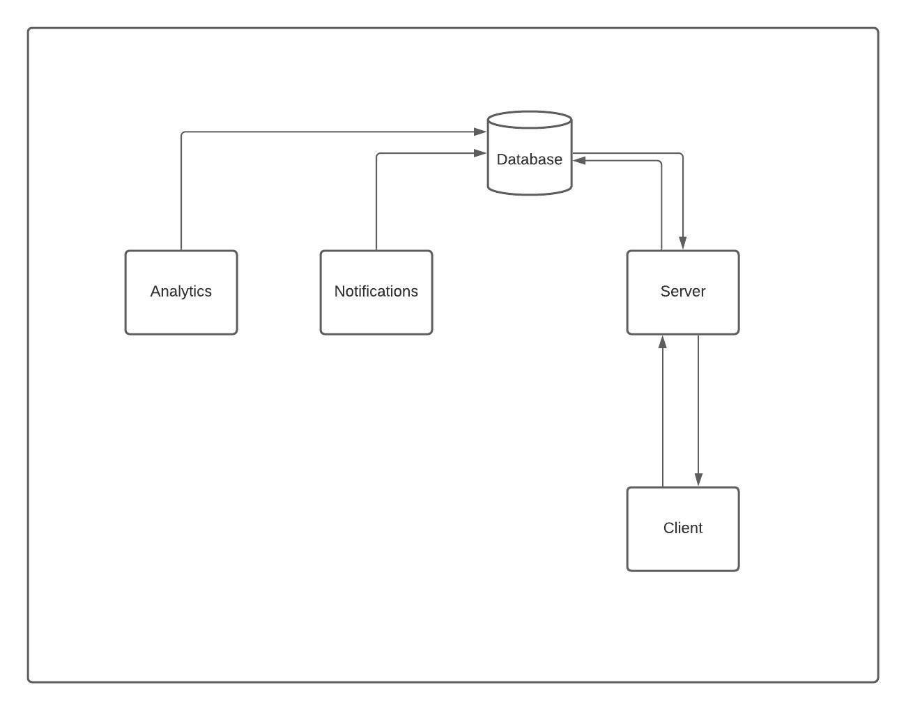

# Chatr - A sample app for using GraphQL Subscriptions + Postgres Subscriptions
The Purpose of this Repo is to demo the features of GraphQL Subscriptions, and PostgreSQL Listen/Notify (PubSub) Feature.

## Architecture

The repo consists of 4 directories
```
Chatr/
┣ analytics/
┣ client/
┣ notifications/
┣ server/
```
Layout of the architecture


### Analytics
- TypeScript Script
- Push data from events to analytics table/db (just emitting logs for now), can be repurposed to push data to Any Datastore.
- Running on a docker-compose file

### Notifications
- TypeScript Script
- Handles customer notifications, useful if we want to trigger side effects like sending an SMS after successful registration, etc
- Running on a docker-compose file

### Server
- TypeScript Server
- Handling traffic between client and DB, uses [Prisma](https://www.prisma.io/) to communicate to the DB, also uses [pg](https://www.npmjs.com/package/pg) to use the Notify/Listen feature.
- Using [Apollo Server](https://www.apollographql.com/docs/apollo-server/) for the GraphQL Server
- Running on a docker-compose file


### Client
- A simple react app, using Material UI for the chat
- uses [Apollo Client](https://www.apollographql.com/docs/react/) to communicate with the server.